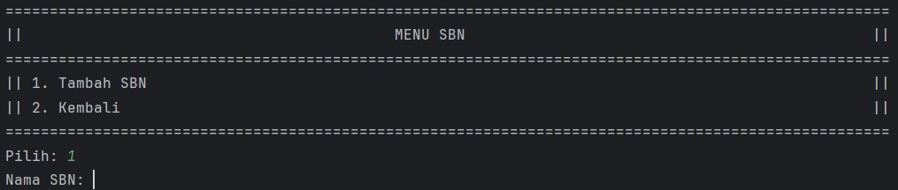

# Pemrograman Berorientasi Obyek
# Program Investasi Sederhana Berbasis Command Line

oleh:  
2405551101-Ni Putu Balina Senalia Devi  
2405551058-Made Amrtasya Saraswati  

Program ini merupakan aplikasi investasi sederhana berbasis command line menggunakan bahasa pemrograman Java.
Pengguna terbagi menjadi dua jenis yaitu Admin dan Customer. Admin dapat mengelola daftar saham dan surat berharga negara (SBN), sedangkan Customer dapat membeli, menjual, dan melihat portofolio investasinya.

## Diagram Kelas (UML)

- Admin: Kelas yang mewakili admin, yang dapat menambah saham, mengubah harga saham, dan menambah produk SBN.  
- Customer: Kelas yang mewakili customer, memungkinkan mereka untuk membeli saham, menjual saham, membeli SBN, dan melihat portofolio mereka.
- Portofolio: Kelas yang menyimpan daftar saham dan SBN yang dimiliki oleh customer, serta menyediakan metode untuk membeli, menjual, dan menampilkan portofolio.
- Saham: Kelas yang menyimpan informasi terkait saham, seperti kode, nama perusahaan, dan harga saham.
- SuratBerhargaNegara: Kelas yang menyimpan informasi terkait produk SBN, termasuk nama, bunga, jangka waktu, tanggal jatuh tempo, dan kuota nasional.
- User: Kelas abstrak yang menangani informasi dasar pengguna, seperti username dan password, serta metode untuk login dan mendapatkan role.
- Validasi: Kelas yang menyediakan metode untuk validasi input, seperti input integer, double, dan string.
- MenuAdmin: Kelas yang menampilkan menu untuk admin, termasuk pilihan untuk mengelola saham dan SBN.
- MenuCustomer: Kelas yang menampilkan menu untuk customer, termasuk pilihan untuk membeli dan menjual saham, membeli SBN, dan melihat portofolio.

## Prosedur Menjalankan Program

##### 1. Clone repository ini melalui link https://github.com/senaliadvp66/Tugas1PBO.git
##### 2. Buka project dengan IDE seperti IntelliJ IDEA.
##### 3. Pastikan sudah menggunakan Java 8 atau lebih baru.
##### 4. Jalankan file Main.java. 

## Tampilan Program
### 1. Awal

 
- Login sebagai Admin

  

    
- Login sebagai Customer

  

     

### 2. Menu Admin

  

#### Menu Saham untuk Admin

 
- Tambah Saham Baru

  
- Ubah Harga Saham

 
- Kembali ke Menu Admin

  

#### Menu SBN untuk Admin

 
- Tambah Produk SBN Baru

 
- Kembali ke Menu Admin

  

#### List Produk Investasi

   

#### Logout

  

### 3. Menu Customer

 

#### Menu Saham untuk Customer

 

- Beli Saham

 
- Jual Saham

  

#### Menu SBN untuk Customer

 
- Beli Surat Berharga Negara (SBN)

 
- Simulasi Investasi SBN

 
- Lihat Portofolio

 
- Logout

  

### 4. Exit

